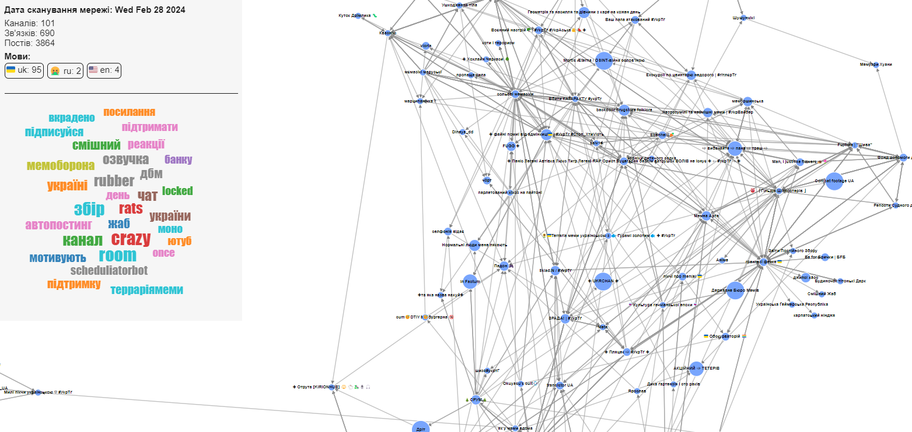

# Telegram Power Toys

This project is designed for the analysis and visualization of channel networks in Telegram. It provides the ability to extract data about channels, their connections to other channels, and posts from these channels. Additionally, the project allows for the processing of this data using various methods to construct an interactive graph of the Telegram channels network.



Check out the [Demo](https://kenobi-knobs.github.io/TelegramPowerToys/) which contains 100 channels 👀

## Table of Contents

- [Installation](#installation)
- [Usage](#usage)
- [Contributing](#contributing)
- [Contacts](#contacts)
- [License](#license)

## Installation
To install and set up the project, follow these steps:

1. **Clone the repository:** 
```bash
git clone https://github.com/Kenobi-Knobs/TelegramPowerToys
```
2. **Install the required dependencies**, run this command in repo directory
```bash
npm install
```
3. **Configure the project settings**:

Below is the configuration file (`config.json`) structure
```json
{
	"firstChanelUsername": "chanel_username",
	"postAnalisisLimit": 100,
	"deepAnalisisLimit": 100,
	"wordmapLimit": 30,
	"dataFolder": "./data",
	"api": {
		"apiId": 123456,
		"apiHash": "1234567890abcdef1234567890abcdef",
		"sesionString": ""
	}
}
```

Here is a breakdown of the different properties in the configuration:

- `firstChanelUsername`: Specifies the username of the first channel to analyze. This is the username of the channel without the `@` symbol, for example `@memecover => memecover`
- `postAnalisisLimit`: Sets the limit for the number of posts to analyze. For example, if it is set to 100, the application will extract the last 100 posts from the channel for analysis.
- `deepAnalisisLimit`: Sets the limit for the depth of the analysis. For example, if 100 is set, it means that the algorithm will extract information about 100 channels that are connected to the initial channel.
- `wordmapLimit`: Sets the limit for the number of words to include in the word map.
- `dataFolder`: Specifies the folder path where the data will be stored. The folder must be within the repository.
- `api`: Contains the API credentials required for accessing the Telegram API. It includes the:
	- `apiId` and `apiHash`: To obtain these parameters, follow the instructions at this [link](https://core.telegram.org/api/obtaining_api_id)
	- `sessionString`: Leave the value as `""`, this field will be generated automatically.

When you have filled all the fields except sessionString **run this command to generate sessionString**.

```bash
npm run generate-session
```

Follow the instructions in the console, if everything is done correctly, you will receive a message with sessionString in saved messages, and this parameter in config.json will be filled

## Usage

For start extracting data use
```bash
npm run grab
```
This command may take some time to execute depending on the settings in config.json. Use it to make tea or coffee ☕️.

After execution, several data files will be created in the selected folder. To start interactive visualization, you need to run this command:

```bash
npm run start
```
This will start a web server with the address http://localhost:3000

Enjoy using it 🎉

## Contributing

To contribute, please follow these guidelines:

1. Fork the repository and create a new branch for your contribution.
2. Make your changes or additions to the codebase.
3. Test your changes to ensure they work as expected.
4. Commit your changes and push them to your forked repository.
5. Submit a pull request to the main repository, explaining the purpose and details of your contribution.

We appreciate your contributions and look forward to your involvement in making Telegram Power Toys even better!

## Contacts

For any questions or inquiries, please feel free to contact us:

- Email: [konchatniyvitaliy@gmail.com](mailto:konchatniyvitaliy@gmail.com)
- Telegram: [@Kenobi_Knobs](https://t.me/Kenobi_Knobs)


## License

This project is licensed under the [MIT License](https://opensource.org/licenses/MIT). 

